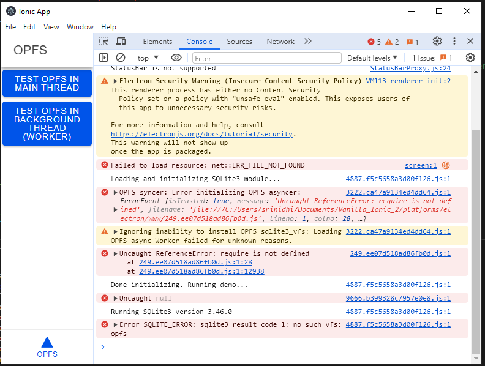

**Build Instructions**
-

```
$ npm install
$ ionic cordova platform add electron
```

*Set COOP and COEP Headers*
Using [sqlite-wasm](https://github.com/sqlite/sqlite-wasm/tree/main) to integrate OPFS requires these two headers to be set. During development, this can be achieved by setting the headers in 
platforms > electron > platform_www > cdv-electron-main.js

```
app.on('ready', () => {
    //...
    
    // Set COOP and COEP headers
    session.defaultSession.webRequest.onHeadersReceived((details, callback) => {
        callback({
            responseHeaders: {
                ...details.responseHeaders,
                'Cross-Origin-Opener-Policy': ['same-origin'],
                'Cross-Origin-Embedder-Policy': ['require-corp']
            }
        });
    });
});
```
Include a reference for `session` in the top level imports:

```
const {
    app,
    BrowserWindow,
    protocol,
    ipcMain,
    net,
    session
} = require('electron');
```

Once the headers are set, run the project targeting electron platform with source map and no-build option (to make the loading faster).

```
$ ionic cordova run electron --no-build --source-map
```

**Test Instructions**
-
1. Launch the app.
2. App provides two option to test OPFS. Foreground / Background (using workers)
3. Selecting either option results in an exception which gets printed to the console.

```error
bootstrap:19 OPFS syncer: Error initializing OPFS asyncer: 
ErrorEvent {isTrusted: true, message: 'Uncaught ReferenceError: require is not defined', filename: 'file:///C:/Users/srinidhi/Documents/Vanilla_Ionic_2/platforms/electron/www/4270.bc9b09e757c4ca57.js', lineno: 1, colno: 28, …}
```



If you inspect the error, you can see that this file: `sqlite3-opfs-async-proxy.js` has been
transformed into xxxx.xxxx.js file with a require statement at the top.

```
 var L, l = require("C:/../../../../node_modules/@babel/runtime/helpers/asyncToGenerator.js").default;
``` 

This package which I'm tryinbg to integrate [sqlite-wasm](https://github.com/sqlite/sqlite-wasm/tree/main) actually produces a ESM module. It seems like the ionic cordova electron stack seems to be transpiling the JS code to CommonJS module syntax which might be causing an issue while trying to access from the browser front end application.